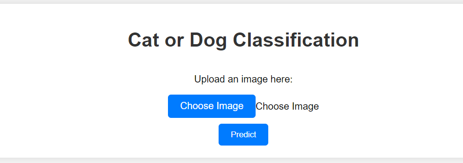
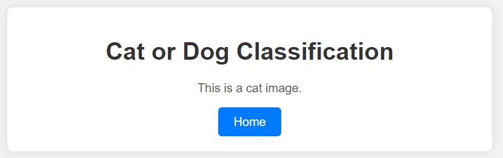
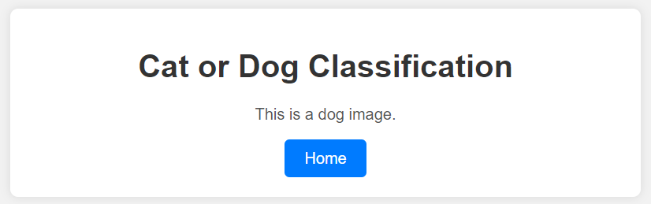

# Cat-Dog Classification Project

This repository contains the code and resources for a cat-dog classification project using deep learning. The project includes data preprocessing, model training, and a web application for real-time cat-dog image classification.

## Dataset
The dataset for this project is available on Kaggle. You can download it [here](https://www.kaggle.com/datasets/tongpython/cat-and-dog). The dataset consists of images of cats and dogs.

## Notebook
The core of the project is the Jupyter Notebook, `notebook.ipynb`. In this notebook, we perform the following steps:

1. Import necessary libraries including NumPy, TensorFlow, and OpenCV.
2. Load and preprocess the images:
   - Import and resize images to 200x200 pixels.
   - Create `X_train` and `X_test` for image data.
   - Define `y_train` and `y_test`, where 0 represents a cat and 1 represents a dog.
   - Convert lists into NumPy arrays.
3. Normalize the image data by dividing it by 255, resulting in `X_train_scaled` and `X_test_scaled`.
4. Train models with different architectures, including:
   - A model with 4 convolution layers, 4 max-pooling layers, 1 flatten layer, and 1 dense layer.
   - A model with 5 convolution layers, 5 max-pooling layers, 1 flatten layer, and 1 dense layer.
   - A model with 6 convolution layers, 6 max-pooling layers, 1 flatten layer, and 1 dense layer.
   - Pre-trained models: VGG16, VGG19, InceptionV3, and ResNet50.
5. Evaluate the models and save the InceptionV3 model with the best performance as `model.h5`. This model achieved a precision of 0.98 and a recall of 0.97.

## Flask Web Application
The project also includes a Flask web application (`app.py`) that allows users to classify cat and dog images in real-time. The `templates` directory contains HTML files for the web app, including `cat.html`, `dog.html`, and `index.html`.

## Running the Flask Web App

To run the Flask web app, follow these steps:
1. Install the required libraries listed in `requirements.txt` using `pip install -r requirements.txt`.
2. Run the Flask app by executing `python app.py`.
3. Open the web app in your browser by navigating to `http://localhost:5000`.

Feel free to reach out if you have any questions or need further assistance. Enjoy your cat-dog classification project!

## Webpage Glimpse:

